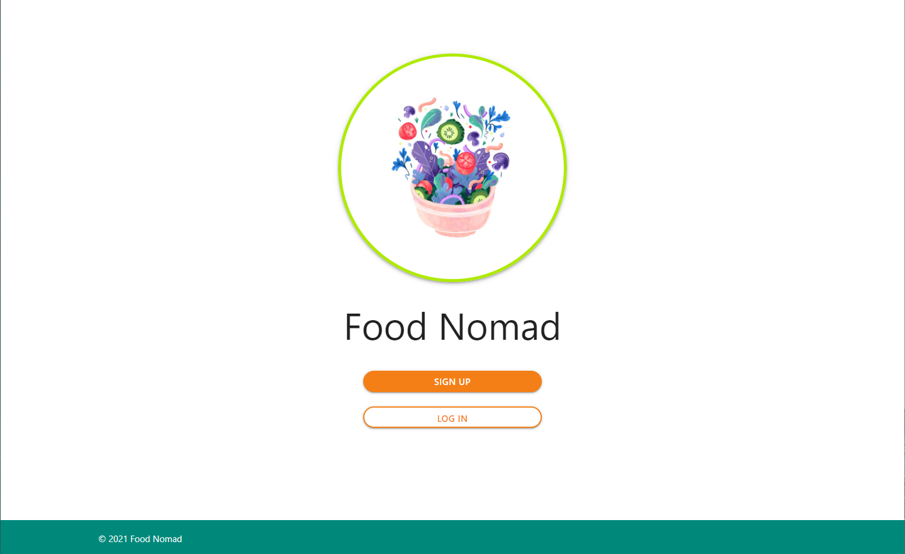
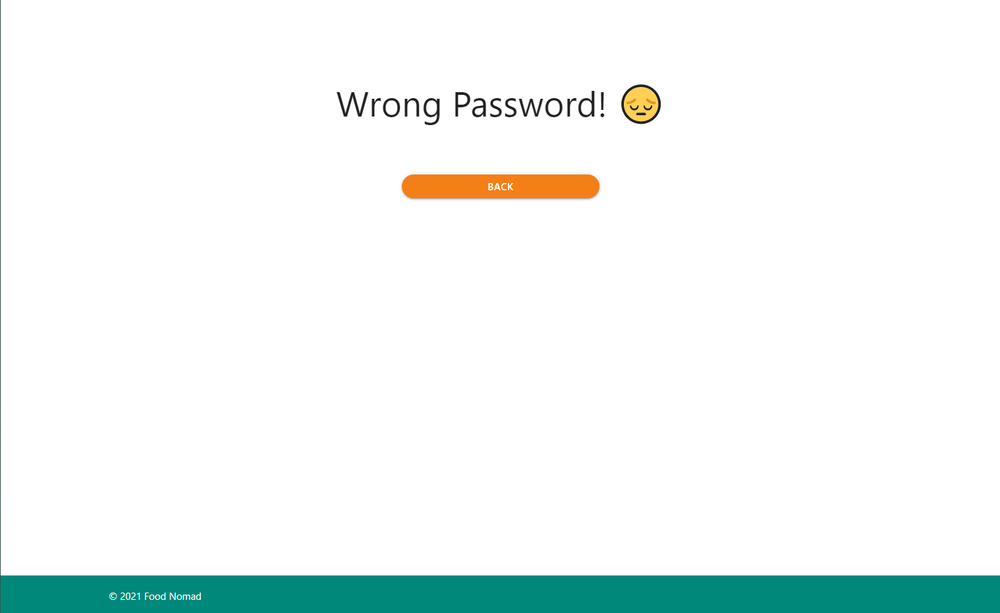
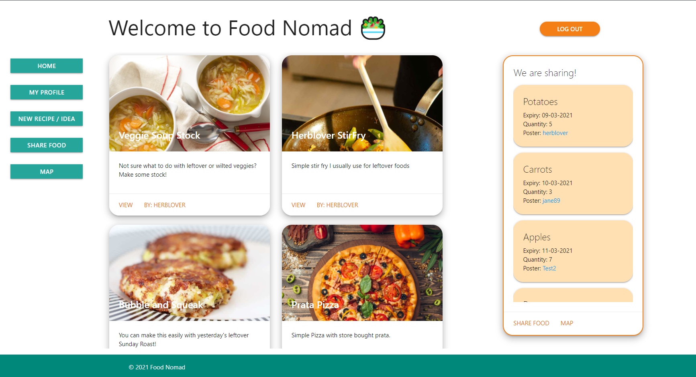
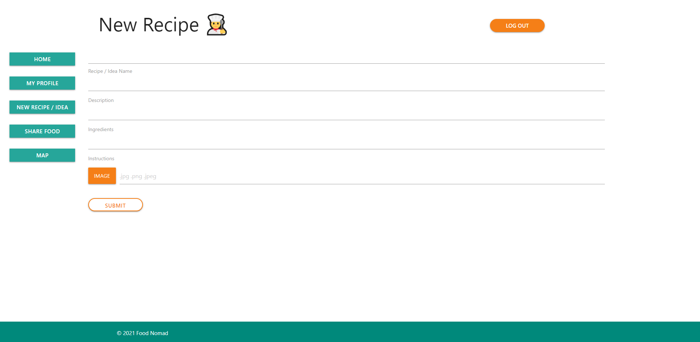
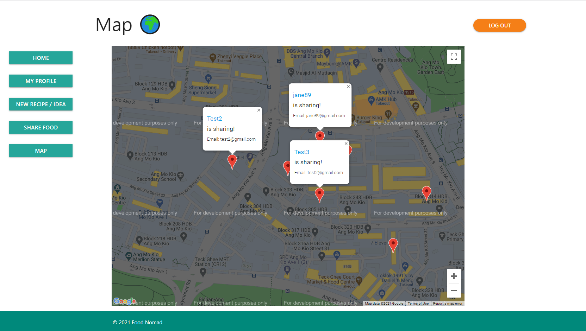
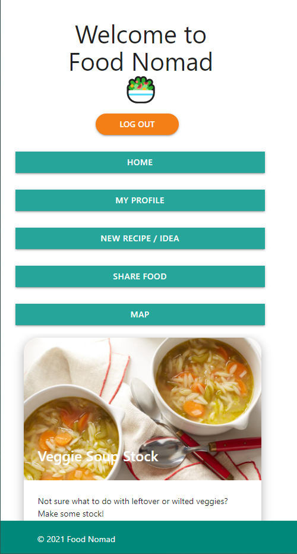

# Food Nomad

## About the app:

---

Food Nomad is an app that advocates the sharing of recipes, lifehacks and excess ingredients within individuals in an effort to reduce food waste.

## App Link:

---

[Food Nomad App Link](https://food-nomad.herokuapp.com/)

## Wireframe:

---

[Food Nomad Web Mockup](https://www.figma.com/proto/UcZCNESBlWCKz99K9GHzox/Food-Nomad-Web-App?node-id=1%3A2&scaling=min-zoom)

## Technologies Used:

---

Server

- express
- method-override
- mongoose
- ejs
- dotenv

Auth

- bcrypt
- express-sessions

Image Storage

- multer
- multer-storage-cloudinary
- cloudinary

APIs

- Onemap API (Geocoding zip codes)
- Google Maps API (Map Display)

## Database:

---

- Mongo DB
- Cloudinary

## Approach Taken

---

Inspired by an app idea of the same name from a friend of mine. I've decided to scope the project into a suitable web app.

[Food Nomad Mobile Mockup](https://www.figma.com/proto/qCspl4i1uAYmXkwF9xs2H7/Food_Nomad_Final?node-id=45%3A0&scaling=scale-down)

My approach is to start with the basic MVP, at it's core its an app to share food recipes and ideas.

Once the basic CRUD is established i extended the recipes to include images.

I've also introduced a Food Schema for users to create and share food, these data
are represented on Index routes and also on a map which utilises Google Maps and One Map.

CSS layout is polished after the MVP and stretch goals are fufilled.

## Achievements

---

- Manage to manipulate and display data onto Google Maps.

- Manage to implement image upload feature for recipes.

## Challenges

---

- Getting promises to work with Google maps as there are calls from the server to the OneMap API as well as Google Map's API.

- Implementing the Cloudinary Image storage with the database

- Ensuring the app can be viewed nicely on mobile.

## Known Issues

---

- On edit food form, if no amendment to the date is done, the date will be saved as an empty string.

- On edit recipe, if no image is uploaded, on redirect, it will result in an error but non-image data will be saved.

- On edit recipe, ingredients will not formatted properly in the form. If saved, it will be one unformatted string.

- On delete food, when deleting from the bottom, the top item is removed instead.

## Screenshots

---

- Log in
  
- Log in error
  
- App Index
  
- Recipe
  
- Recipe Form
  
- Maps
  
- Mobile Version

  

## RESTful Routes

---

| No | Route   | URL                    | HTTP Verb | Description          |
|----|---------|------------------------|-----------|----------------------|
| 1  | Index   | /app                   | GET       | Log In/Sign Up page  |
| 2  | Index   | /app                   | GET       | App Main             |
| 3  | Index   | /app/profile           | GET       | Current User Profile |
| 4  | Index   | /app/profile/:username | GET       | Other User Profile   |
| 5  | New     | /users/new             | GET       | New User Form        |
| 6  | New     | /sessions/new          | GET       | Returning User Form  |
| 7  | New     | /app/recipe/new        | GET       | New Recipe Form      |
| 8  | New     | /food/new              | GET       | New Food Form        |
| 9  | Create  | /app/profile           | POST      | Make New Recipe      |
| 10 | Create  | /food/                 | POST      | Make New Food        |
| 11 | Create  | /users/                | POST      | Make New User        |
| 12 | Create  | /sessions/             | POST      | Make New Session     |
| 13 | Show    | /app/recipe/:id        | GET       | Show Recipe Page     |
| 14 | Show    | /food/map              | GET       | Show Map             |
| 15 | Show    | /food/data             | GET       | Get data payload     |
| 16 | Edit    | /app/recipe/:id/edit   | GET       | Edit Recipe Form     |
| 17 | Edit    | /food/:id/edit         | GET       | Edit Food Form       |
| 18 | Update  | /app/recipe/:id        | PUT       | Update Recipe        |
| 19 | Update  | /food/:id              | PUT       | Update Food          |
| 20 | Destroy | /app/recipe/:id        | DELETE    | Delete Recipe        |
| 21 | Destroy | /food/:id              | DELETE    | Delete Food          |

## Extra Features Planned

---

- Dark Theme
- Able to 'like' user recipes.
- Able to by most liked recipes.
